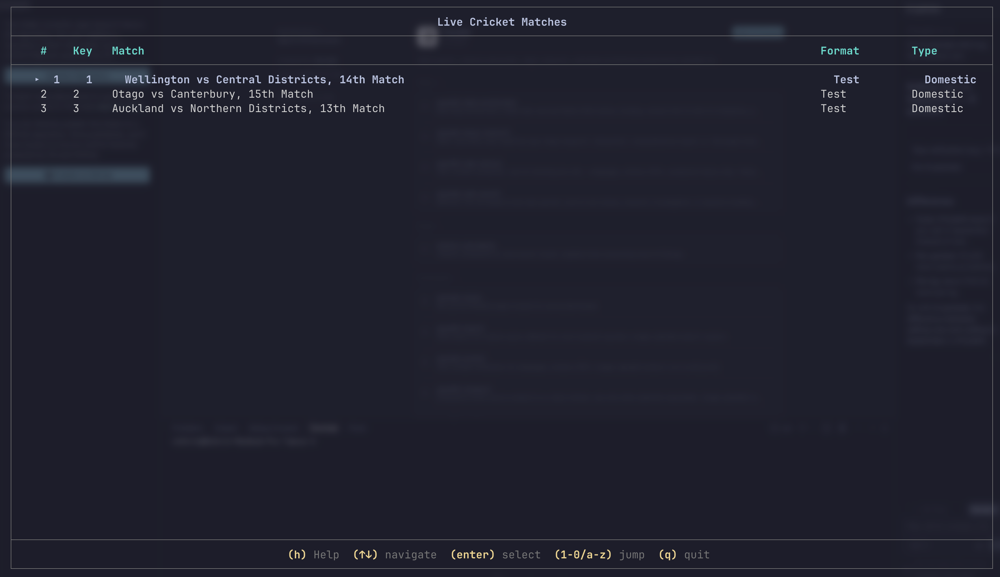
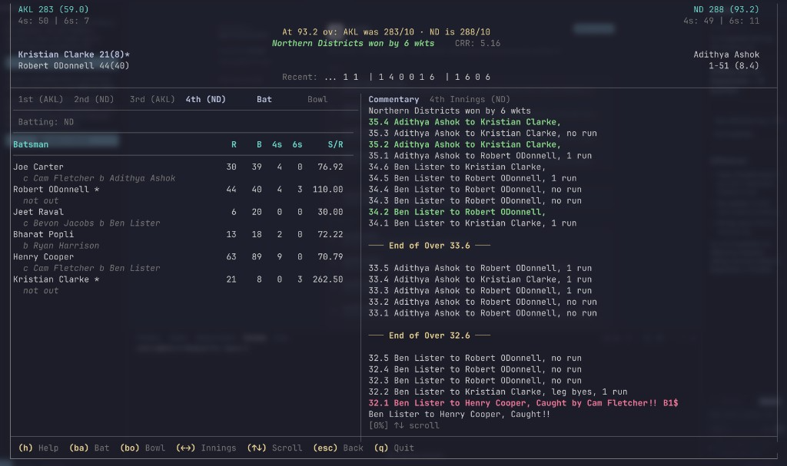

<h1 align="center">crictui</h1>

<p align="center">
Live cricket scores in your terminal — minimal TUI for viewing scoreboards and commentary
</p>

---

## Features

- **Live cricket scores** — Real-time updates from Cricbuzz
- **Match details** — Team scores, current batsmen, bowler figures
- **Full scorecards** — Batting and bowling stats per innings
- **Commentary** — Ball-by-ball commentary in the match view (all innings for Tests)
- **Innings navigation** — Switch between all innings (supports 3rd/4th in Tests)
- **Batting / bowling toggle** — View either batting or bowling table
- **Multi-match support** — Browse and open multiple live matches
- **Match list summary** — Table view with **Format** (Test/ODI/T20) and **Type** (Intl/Domestic/Women)
- **Clean layout** — Minimal, terminal-friendly design

## Screenshots

<p align="center">
  <strong>Live match list</strong><br>
  
</p>

<p align="center">
  <strong>Scorecard and commentary</strong><br>
  
</p>

## Requirements

- **Go 1.24+** (when building from source)

## Installation

### From source

```bash
git clone https://github.com/12345nikhilkumars/crictui.git
cd crictui
go build
# optional: sudo mv crictui /usr/local/bin/
./crictui -h
```

## Usage

```bash
# List and select from live matches
crictui

# Open a specific match by ID
crictui --match-id 118928
crictui -m 118928

# Set refresh interval (default: 40000 ms)
crictui --tick-rate 30000
crictui -t 30000

# Help
crictui --help
```

**Match ID:** Open the match page on [Cricbuzz](https://www.cricbuzz.com) and take the ID from the URL:  
`https://www.cricbuzz.com/live-cricket-scorecard/<id>/...`

### Controls

**Match list**

| Key        | Action           |
| ---------- | ---------------- |
| **↑** **↓** | Move selection   |
| **Enter**  | Open match       |
| **q**      | Quit             |

**Match view**

| Key        | Action                |
| ---------- | --------------------- |
| **h**      | Show help             |
| **b** **a** | Batting scorecard    |
| **b** **o** | Bowling scorecard    |
| **←** **→** | Previous/next innings (1st–4th) |
| **↑** **↓** | Scroll commentary     |
| **1–4**     | Jump to innings by number |
| **Esc**    | Back to match list    |
| **q**      | Back to list / quit   |

## Dependencies

- [Bubble Tea](https://github.com/charmbracelet/bubbletea) — TUI framework
- [Lipgloss](https://github.com/charmbracelet/lipgloss) — Styling and layout
- [Cobra](https://github.com/spf13/cobra) — CLI

## Acknowledgments

- [Cricbuzz](https://www.cricbuzz.com) for cricket data
- [Charm](https://charm.sh/) for Bubble Tea and Lipgloss

## Contributing

Contributions are welcome. Open an issue or submit a pull request.

## Contributors

<a href="https://github.com/12345nikhilkumars/crictui/graphs/contributors">
  
</a>

<br><br>

<p align="center">
  
</p>

<p align="center">
  <i>© 2026–present <a href="https://github.com/12345nikhilkumars">12345nikhilkumars</a></i>
</p>

<div align="center">
  <a href="https://github.com/12345nikhilkumars/crictty/blob/main/LICENSE">
    
  </a>
</div>
